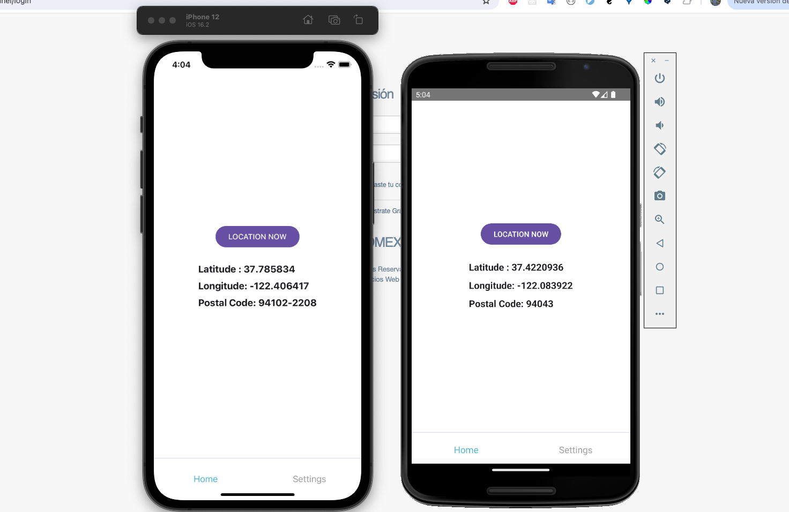
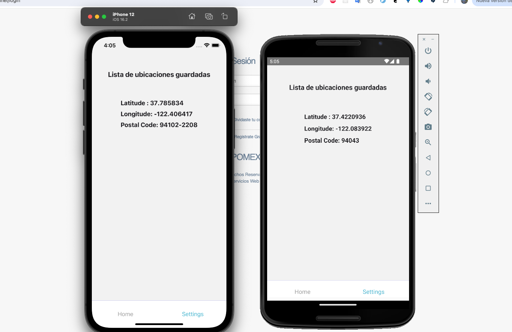

# Proyecto de prueba tecnica para Mis Desarrollos

## El proyecto consite en hacer una aplicación movil con multiplataforma, por lo cual opte por usar React Native. En donde como objetivo tuvimos que obtener las cordenadas del equipo y a su vez como un paso extra, con esas coordenasdas se realizo la petición a una API publica para obtener el código postal de acuerdo a las coordenas previamente obtenidas.

### NOTA: Como se puede apreciar en las imagenes adjuntas, el código postal mostrado es de acuerdo a las coordenas del emulador por tal motivo es posible que no coincidan a tu ubicación real.

# Resultado del proyecto (Imagenes)

# Instrucciones para ejecutar el proyecto

- En la raiz del proyecto ejecutar el comando:
  yarn install
- Para ejecutar el proyecto en iOS es neceserio ejecutar el siguinte comando estando en la raiz del proyecto
  cd ios && pod install
- Una vez terminada la instalación ejecutamos el siguiente comando para iniciar la aplicación en iOS
  npx react-native run-ios
- Para la versión de Android solo basta con ejecutar el siguiente comando para ejecutarlo
  npx react-native run-android
